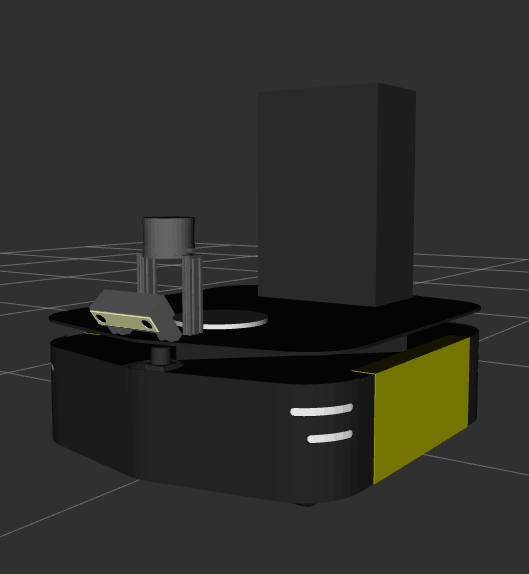

# nuridgeback_description

# Overview
Contains the Ridgeback's URDF. If you are looking for the Sawback's urdf see the [sawback](https://github.com/bostoncleek/sawback) package.

<p align="center">
  
</p>

# Launch
To see the robot in rviz with joint_state_publisher gui:
```
roslaunch nuridgeback_description view_ridgeback.launch use_jsp_gui:=true
```
